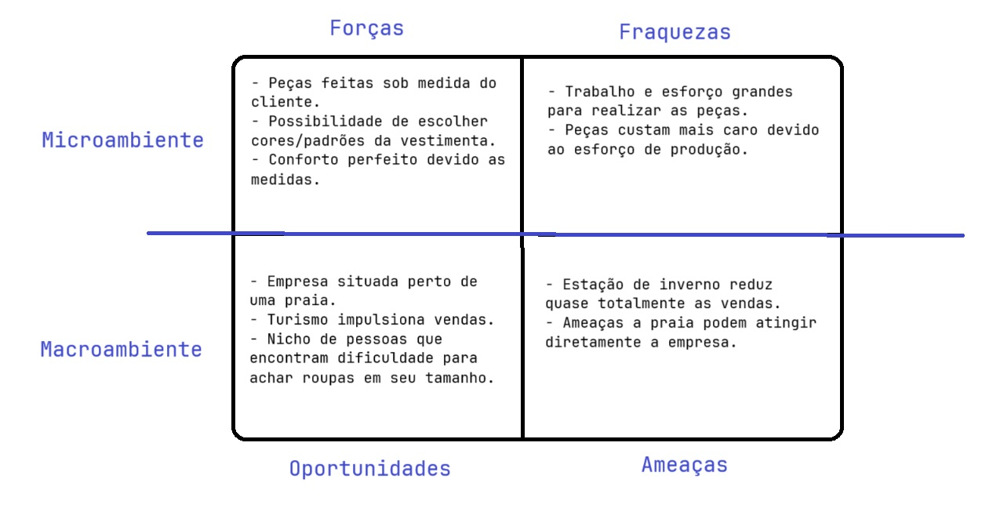

# Atividade

**Aluno:** Fernando Petri  
**RA:** 20240774  
**Tipo de empresa:** Comércio de vestimentas para a praia.  

# Elabore o conceito SWOT de uma empresa fictícia

## Forças

- Peças feitas sob medida do cliente.
- Possibilidade de escolher cores/padrões da vestimenta.
- Conforto perfeito devido as medidas.

## Fraquezas

- Trabalho e esforço grandes para realizar as peças.
- Peças custam mais caro devido ao esforço de produção.

## Oportunidades

- Empresa situada perto de uma praia.
- Turismo impulsiona vendas.
- Nicho de pessoas que encontram dificuldade para achar roupas em seu tamanho. 

## Ameaças

- Estação de inverno reduz quase totalmente as vendas.
- Ameaças a praia podem atingir diretamente a empresa.

## Gráfico

