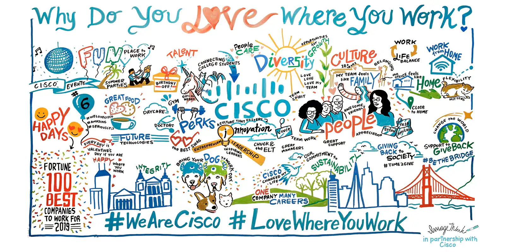

# Cisco

https://www.cisco.com/site/us/en/about/purpose/index.html#jump-anchor-1
https://www.cisco.com/c/en/us/about/careers.html#~benefits-and-perks
https://www.cisco.com/c/en/us/about/careers/we-are-cisco/conscious-culture.html

## Cultura Organizacional da empresa CISCO

### Origem

Fundada em 1984 por Leonard Bosack e Sandy Lernercom, a empresa estadunidense CISCO foi e ainda é uma das pioneiras na área de tecnologia da informação, originando-se com o único propósito de produzir roteadores em grande escala, e hoje, como uma grande provedora de serviços relacionados a tecnologia.

### Tipo de cultura

Diante da necessidade de eficiência, resultado, e da grande competividade do mercado de tecnologia, é normal muitas empresas adotarem uma cultura organizacional focada em Eficiência, ou Competitividade, contanto, a empresa Cisco adota um tipo de cultura organizacional muito mais humana e focada em pessoas, focando seus valores nas que produzem uma melhora no mundo, comunidades, e até mesmo para seus funcionários. Deste modo a empresa se divulga com um tipo de cultura "Consciente", focada na constante observação e melhoria de seus ambientes internos e externos, muito parecida com a cultura organizacional focada em pessoas.

### Valores

Diante deste tipo de cultura organizacional, e diferente de muitas empresas de tecnologia que tem seus valores voltados para Inovação, a empresa Cisco tem um foco mais humano, valorizando valores como diversidade, igualdade, e melhorias na sociedade no geral, não desvalorizando valores importantes como sustentabilidade e segurança. Alguns de seus principais valores são:

- Sustentabilidade: Busca um futuro mais sustentável visando a diminuição de carbono expelida pelos seus fornecedores e clientes.
- Impacto Social: Busca através de suas redes reduzir as causas raízes de desigualdade, construindo novos sitemas para o bem de todos.
- Diversidade e inclusão: Reconhece o grande espectro de diversidade, diminuindo as desigualdades dentro e fora da empresa.
- Segurança: Visa proteger sistemas, dados respeitando os direitos humanos de todos.

### Benefícios

Nos dias de hoje, a empresa permanece com o prémio de "Melhor lugar para trabalhar nos Estados Unidos" por 3 anos seguidos, fora suas outras medalhas em outros países como Portugal, Mexico, Espanha e outros. Justo a isso, a empresa é quase como uma referência a outras empresas no quesito de cultura organizacional, especialmente devido a grande lista de benefícios que a mesma disponibiliza para seus funcionários como: Compensação competitiva, bônus anuais, reembolsos de mensalidade de instituições relacionadas, folga no dia de seu aniversário, práticas de trabalho flexíveis e muitos outros.

